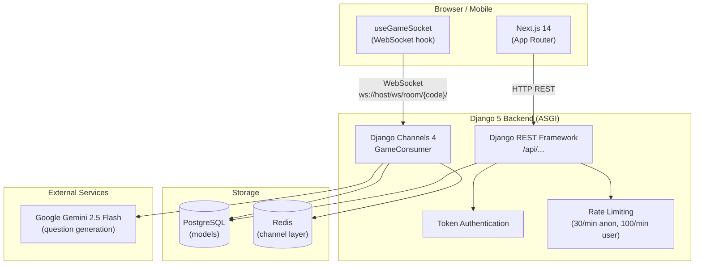
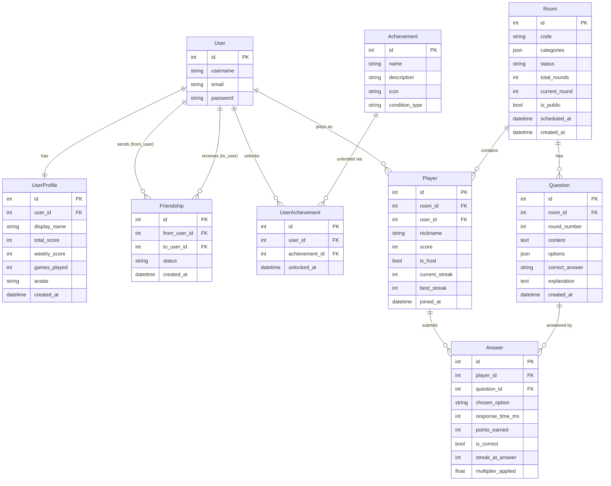
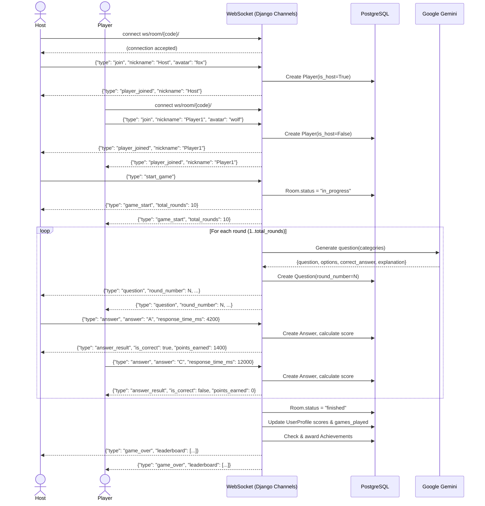
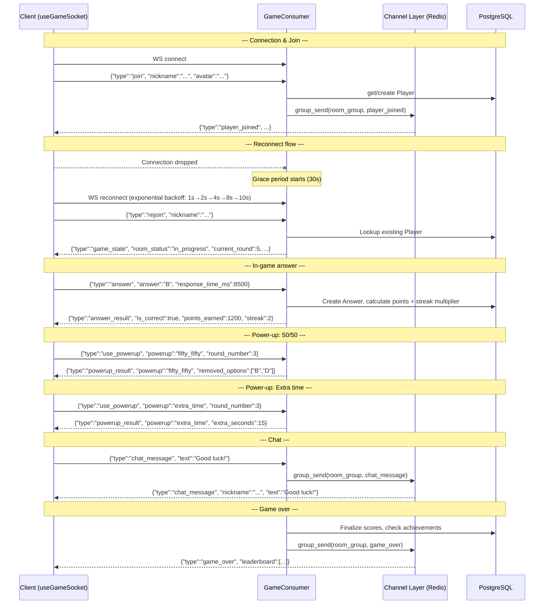
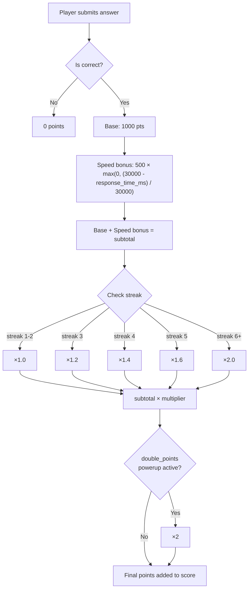

# QuizArena — Architecture

This document contains Mermaid diagrams describing the system architecture, data model, and key runtime flows.

---

## 1. System Architecture

---

## 2. Database ER Diagram

---

## 3. Game Flow Sequence Diagram

---

## 4. WebSocket Message Flow Diagram

---

## 5. Scoring Algorithm

---

## 6. Constants Reference

| Constant | Value | Description |
|----------|-------|-------------|
| `TIMER_SECONDS` | 30 | Seconds per question |
| `BASE_POINTS` | 1 000 | Points for a correct answer |
| `MAX_SPEED_BONUS` | 500 | Maximum speed bonus |
| `GRACE_PERIOD_SECONDS` | 30 | Reconnect window before player removal |
| `MIN_PLAYERS_AUTO_START` | 2 | Minimum players to auto-start a public game |
| `PUBLIC_GAME_INTERVAL_MINUTES` | 30 | Interval between scheduled public games |
| `EXTRA_TIME_SECONDS` | 15 | Extra time added by `extra_time` power-up |
| `CHAT_MAX_LENGTH` | 200 | Maximum chat message length (chars) |
| `MAX_RECONNECT_RETRIES` | 5 | Frontend reconnect attempts (exponential backoff) |
